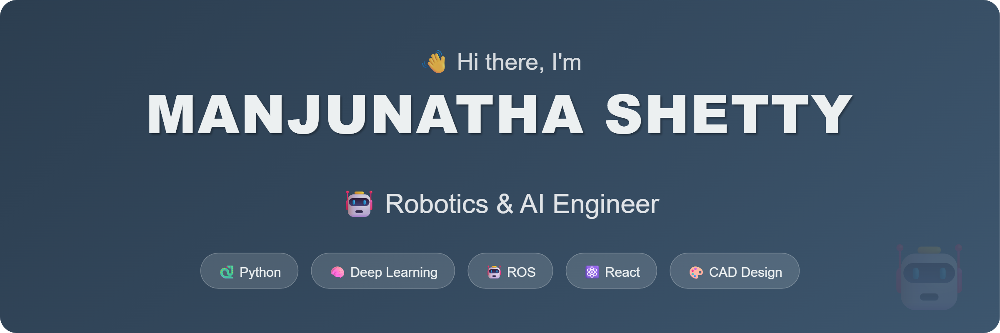

# 💫 About Me

🎓 Completed **B.E in Robotics and Artificial Intelligence** from NMAMIT  
👯 Open to collaborating on **cutting-edge AI & robotics projects**  
⚡ Hands-on experience in **AI, Web Development, and Robotics**  
🛠️ Built projects using **FastAPI, Streamlit, OpenCV, and TensorFlow**  
🤝 Seeking opportunities in **advanced deep learning** and **robotics engineering**  
💬 Ask me about **Robotics, AI, Deep Learning, Computer Vision, Image Processing, and CAD Design**

## 🌐 Socials:
 

## 💻 Tech Stack

### 🖥️ Programming Languages  
      

### 🌐 Web Development & Backend  
      

### 🤖 AI & Machine Learning  
                  

### 👁️ Computer Vision & Image Processing  
      

### 🤖 Robotics & Simulation  
      

### 🛠️ Tools & Platforms  

# 📊 GitHub Stats:
 
 

---

## 👁️ Profile Views

---

